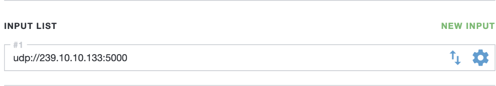
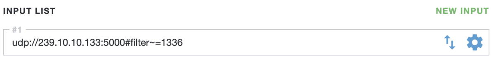

Stream filtering plays a crucial role in optimizing media streams and delivering a seamless experience to end users. When providing services to users in different regions, it is often unnecessary to include all language options for every client. To address this, Cesbo Astra offers a powerful filtering capability within its interface, allowing administrators to tailor the content transmitted to end users based on specific broadcasting conditions. This not only reduces the load on the server responsible for broadcasting the media streams but also enhances the end user experience by eliminating unnecessary elements and focusing on relevant content. By leveraging stream filtering, Cesbo Astra empowers administrators to streamline content delivery, ensuring a more efficient and user-friendly media streaming experience.

## Analyze Channel

To determine the available media streams with language options for a channel in Astra interface, you need to analyze the channel and gather information about the available media streams and their respective Packet Identifiers (PIDs).

1. Open the main Dashboard window in Astra and choose the desired channel. Click on the channel to select it

2. In the settings menu for the selected channel, click the "Analyze" button. This will initiate the channel analysis process

3. Once the analysis is complete, the settings tab will display a list of the available media streams associated with the selected channel. This list will include information about the channel, including available media streams and their PIDs

In the Analysis window, detailed information about the media streams of the channel is presented, which is particularly useful during channel tuning. The following information is of interest:

1. VIDEO PID:1331
2. SUB PID: 1335, Language: bul (Bulgarian)
3. AUDIO PID: 1332, Language: bul (Bulgarian)
4. AUDIO PID: 1336, Language: eng (English)

These parameters indicate that the channel consists of one video stream, one subtitled media stream, and two audio streams.

## Audio stream filtering

In order to filter media streams by broadcast languages, you need to select the PID ID of the required language streams, and then close the Analysis tab, returning to the settings window. To filter the media streams by language, follow these steps:

1. In the channel settings, navigate to the Input section, which contains the settings for incoming media streams

2. There are two sorting options available: filter=N and filter~=N
   - filter=N: This option is used to remove the specified PID identifiers. Multiple identifiers are separated by commas.
   - filter~=N: This option is used to retain only the specified PID and service tables while removing all other data. Multiple identifiers are separated by commas.    

    Select one of these options and add it to the input address

The "#" symbol defines the beginning of entering parameters for the input stream, after which the command itself is written, as well as the PIB ID to which it applies. If you need to enter more than one command, then they are separated by the symbol ",".
Example: `udp://239.10.10.133:5000#filter=1336,1332`

3. Save the changes by clicking the "Apply" button at the bottom of the channel settings page

If you wish to revert the sorted media streams to their original state, simply remove the filtering options from the input stream parameters