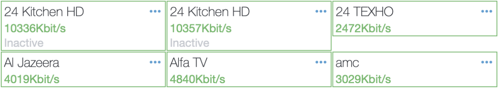
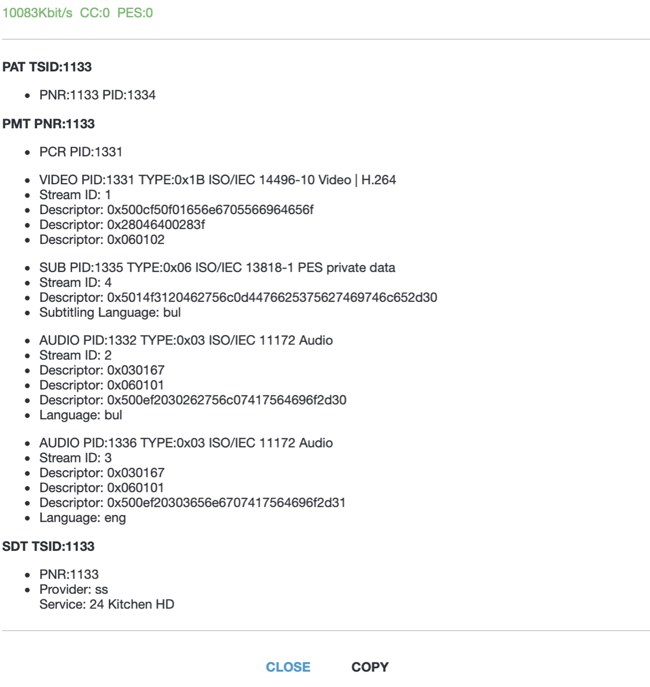

The Remap function in Cesbo Astra allows manual modification of the PID (Packet Identifier) of a media flow. PIDs are used to configure and deliver content to the end user, and Astra automatically assigns them for easy streaming organization. However, there are scenarios where manual PID changes are necessary, and Remap serves this purpose.

## Basic purposes

The main objective of the Remap function is to adjust the reservation of a media flow. Each audio and video flow has unique PIDs. In situations where one media flow is reserved from different sources, the reserved PID and its backup version may not match, causing transmission errors when the backup stream is activated. Remap enables the synchronization of PIDs, ensuring uninterrupted operation of the media flow.

The second objective of Remap is to prevent conflicts when adding multiple media flows to a single MPTS (Multi-Program Transport Stream). Such conflicts are rare due to Astra's automatic PID configuration, but Remap provides independent control if required.

## Remap in Astra interface

1. Open the main Dashboard window in Astra and choose the desired channel. Click on the channel to select it

2. In the settings menu for the selected channel, click the "Analyze" button. This will initiate the channel analysis process

3. Once the analysis is complete, the settings tab will display a list of the available media streams associated with the selected channel. This list will include information about the channel, including available media streams and their PIDs

In the Analysis window, detailed information about the media streams of the channel is presented, which is particularly useful during channel tuning. The following information is of interest:

1. VIDEO PID:1331
2. SUB PID: 1335, Language: bul (Bulgarian)
3. AUDIO PID: 1332, Language: bul (Bulgarian)
4. AUDIO PID: 1336, Language: eng (English)

These parameters indicate that the channel consists of one video stream, one subtitled media stream, and two audio streams.

4. Close the analysis window and navigate to the Remap tab in the channel settings

## Remap Configuration

**Map PIDs** - This input field allows you to modify PID numbers. Multiple changes can be specified by separating them with commas (,)

Example:
- 1003=200: Change PID 1003 to 200.
- audio=100: Change audio PID to 100.
- video=107: Change video PID to 107.
- ttx=108: Change teletext PID to 108.
- pmt=109: Change PMT PID to 109.
- ait=103: Change AIT PID to 103.
- pcr=111: Change PCR PID to 111.
- sub=112: Change subtitles PID to 112.
- ac3=113: Change AC3 audio PID to 113.
- aac=114: Change AAC audio PID to 114.

::alert
The maximum PID value is 8190, and the recommended minimum value is 32
::

**Filter PIDs** - this input field allows you to specify PIDs that will not be displayed or transmitted to the end user

**Change PNR** - this input field is used to modify the PNR number (SID)

**Change TSID** - this input field is used to modify the transport stream ID number