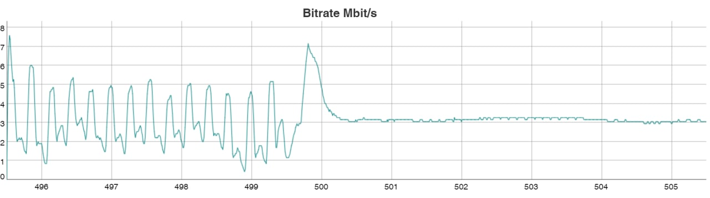

Data encoding is necessary to reduce data size transferred over network. Most common video encoding formats:

| Standard | Name |
| --- | --- |
| ISO/IEC 13818-2 | MPEG-2 Video (MPEG-2 part 2) |
| ISO/IEC 14496-2 | MPEG-4 Visual (MPEG-4 part 2) |
| ISO/IEC 14496-10 | h.264 (AVC или MPEG-4 part 10) |
| ISO/IEC 23008-2 | h.265 (HEVC или MPEG-H part 2) |

## Video encoding steps

- Convert RGB to YCbCr color space with chroma subsampling
- Analyze samples
- DCT
- Compressing with RLE and Huffman coding

## Macroblock

- Y - luma component
- Cb - blue-difference chroma component
- Cr - red-difference chroma component

// TODO: about Y:Cr:Cb

- 4:4:4
- 4:2:2
- 4:2:1
- 4:2:0

## Frames type

- I-frame (Intra-coded frame, keyframe)
- P-frame (Predicted frame)
- B-frame (Bi-predicted frame)
- D-frame (Direct-coded picture)

// TODO: short intro to GOP

## GOP

For example, on the chart is a same stream with average bitrate about 3Mbit/s.
Left part of chart is an encoded stream with GOP 7.
Right part of chart is an encoded stream with GOP 1.

## PTS

Each frame should be decoded in the certain time.

// TODO: more about PTS

## DTS
