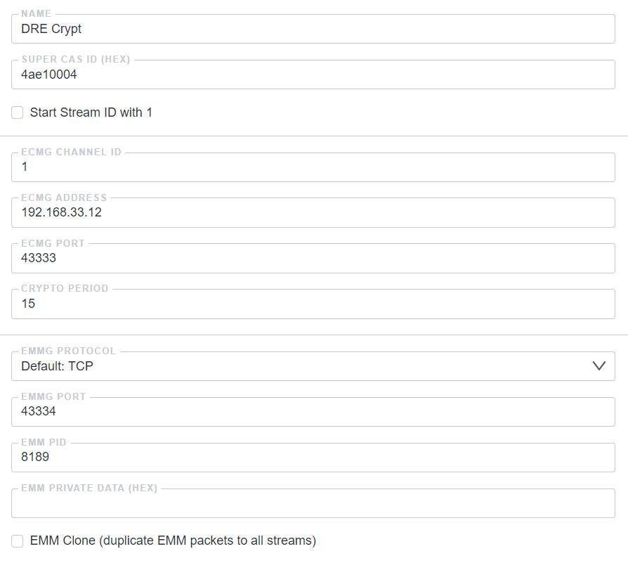

Simulcrypt is a DVB Protocol for simultaneous use of multiple Conditional Access Systems in a stream.

Conditional Access (CA) or Conditional Access System (CAS) is the protection of content by requiring certain criteria to be met before granting access to the content. The term is commonly used in relation to digital television systems.

- NAME - arbitrary name-used for easy identification.
- Super CAS ID - CAS Identifier is an 8 hexadecimal symbols
- Start Stream ID with 1 - by default, stream numbering starts at 0. For some CAS (example: CTI), the numbering should be starts at 1.
- ECMG Channel ID - channel number when connecting to CAS
- ECMG Address - IP address of the ECMG server
- ECMG Port - server ECMG port
- Crypto period - Key change interval, usually 10 seconds
- EMMG Protocol - The current implementation uses TCP
- EMMG Port - The port where the Astra will wait for a connection from the EMG server
- EMM PID - PID for EMM packages in the system (user Defined)
- EMM Private Data - data to add to the CAT table. (This data can be issued by the CAS provider. In their absence - filling is not required)

## Stream settings

- ECM PID - PID for ECM packages (User defined)
- ECM Private Data - the data of the conditional access system is added to the description of the ECM stream in the PMT table. If these parameters do not exist, you do not need to add them
- Access Criteria - this data will be provided by the CAS provider or defined on the CAS server


Several different CAS can be used for one stream. For example: `Conax` with `DRE Crypt`.
Encryption will be performed with single key

