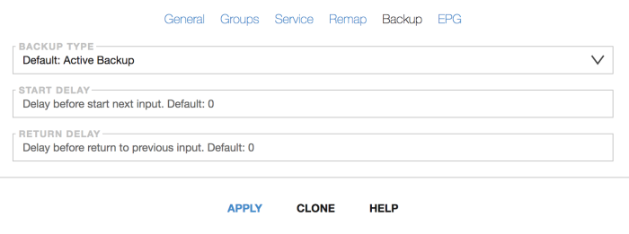

- Backup type:
    - Active backup (default)
    - Active backup and Stop streaming if all inputs are inactive
    - Passive backup
    - Disable backup
- Start delay - delay in seconds, before switching to the next source
- Return delay - delay in seconds, before switching to the previous source. Only for Active backup

Switching conditions: PES error, CC error, channel encrypted, or no bitrate.

## Active backup

Starts next input if previous became inactive. All previous inputs keeps active for analyzing.
When any previous input become active all low priority inputs is turned off.

Astra will continue broadcasting from the last source in the list, even if the data stream contains errors.
Usually last source is a looped stream with test pattern or with message.

To turn off streaming if all inputs is inactive need to choose "Active backup and Stop streaming"

## Passive backup

Switch to next input if previous became inactive. Previous input will be turned off.

## Disable backup

Astra keep streaming from active input on any errors.
Active input could be changed on dashboard (Stream menu -> Toggle Input) or with API.
