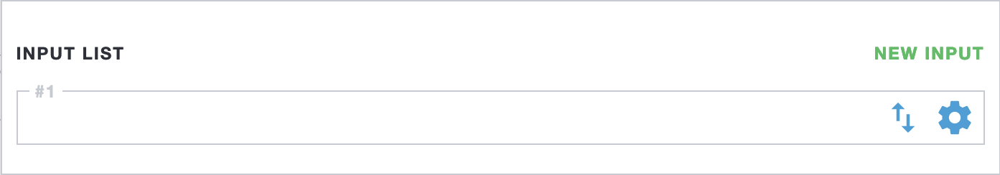

# UDP

UDP is a low latency protocol for local networks. [Read more](/en/book/delivery/udp)

## Address format

```
udp://address
udp://address:port
udp://interface@address:port#options
```

- `interface` – name of the local interface. The system routing table used by the default;
- `address` – IPv4 address of the stream. Multicast or unicast;
- `port` – port number. Default: **1234**.

Options:

- `pnr=Number` - select program from MPTS (Multi-Program Transport Stream)
- `sync` – receives UDP in separate thread with bitrate syncing
- `renew=Seconds` – renewing multicast group subscription after a specified time
- `socket_size=Bytes` – size of the system socket. Default: `sysctl net.core.rmem_default`

For example:

- `udp://127.0.0.1:10001` - receiver stream to localhost with port 10001. Useful to transfer stream between different services. For example receive transcoded stream from FFmpeg
- `udp://eth0@239.255.1.1#pnr=1` - receive multicast group 239.255.1.1 on interface eth0. Option `pnr` enables stream demultiplexing and selects program with number 1

## Web Interface

In the web interface UDP Input options available in the Stream options. You can write source address directly to the Input address line:

{: width="400"}

Or click to the gear icon and use an Input configuration form:

{: width="400"}

## Troubleshooting

In most cases issue cause is a system or network configuration. To find a solution needed:

<details class="marker">
<summary>Astra MPEG-TS analyzer</summary>

With Astra you can analyze any supported source. Just launch in console next command:

```
astra --analyze "udp://eth0@239.255.1.1:1234"
```

To stop `astra` press `Ctrl+C`

</details>

<details class="marker">
<summary>TCPDUMP</summary>

`tcpdump` is a common tool to check network traffic. For example, command to check UDP multicast receiving to group `239.255.1.1` on the interface `eth0`:

```
tcpdump -pnni eth0 udp and host 239.255.1.1
```

!> If you don't know actual interface you may find it with command:
`ip route get 239.255.1.1`

The `tcpdump` output looks like many lines with information about packets source, destination, and length. For example:

```
21:38:42.143839 IP 192.168.88.100.33610 > 239.255.1.1.1234: UDP, length 1316
21:38:42.143868 IP 192.168.88.100.33610 > 239.255.1.1.1234: UDP, length 1316
```

To stop `tcpdump` press `Ctrl+C`

</details>

### Not working

Not working means a zero bitrate in the Astra MPEG-TS Analyzer output. Example:

```
Jan 27 09:00:00: INFO: Bitrate: 0 Kbit/s
Jan 27 09:00:01: INFO: Bitrate: 0 Kbit/s
```

First of all check traffic on the network interface with `tcpdump` tool. If there is no information about incoming packets, then need to check network configuration or source configuration.

<details class="marker">
<summary>Not working: No packets in tcpdump output. Check IGMP version</summary>

Most Linux distributions uses IGMPv3 protocol to manage subscription to the multicast group.

If network switch doesn't support IPGMv3 protocol or protocol is not configured on the switch, then need to turn IGMPv2 in the Linux settings. IGMPv2 is supported by most switches.

Append to the file `/etc/sysctl.conf` next line:

```
net.ipv4.conf.eth0.force_igmp_version=2
```

Where `eth0` is an interface name and `2` is a IGMP version. To apply changes restart system or launch:

```
sysctl -p
```

You can verify IGMP version with tcpdump:

```
tcpdump -i eth1 igmp
```

</details>

<details class="marker">
<summary>Not working: Check firewall configuration</summary>

If `tcpdump` shows information about packets need to check **Firewall** configuration. Firewall depend of your Linux Distribution and better to check manual to your operation system.

</details>

<details class="marker">
<summary>Not working: Check RP filter configuration</summary>

**RP filter** - is a technology that provides protection and security of the server when using multicast mailings. If your server has several network interfaces, recommend to set routes for multicast groups. If this is not possible, change the RP filter settings:

Append to the file `/etc/sysctl.conf` next line:

```
net.ipv4.conf.eth0.rp_filter = 2
```

Where `eth0` is an interface name. To apply changes restart system or launch:

```
sysctl -p
```

</details>

### Too many errors on receiving UDP

CC (Continuity Counter) errors indicates that packets continuity is corrupted. Error can be caused by packets loss or excess. Example output with CC errors in the Astra MPEG-TS Analyzer:

```
Jan 27 09:00:00: INFO: Bitrate: 13259 Kbit/s
Jan 27 09:00:00: ERROR: CC: PID:18=3 PID:20=3 PID:256=24
Jan 27 09:00:01: INFO: Bitrate: 13261 Kbit/s
Jan 27 09:00:01: ERROR: CC: PID:18=5 PID:20=2
```

<details class="marker">
<summary>Too many errors on receiving UDP: Packets excess</summary>

Excess packets looks in the `tcpdump` output as packets from different sources to the same destination:

```
21:38:42.143839 IP 192.168.88.100.33610 > 239.255.1.1.1234: UDP, length 1316
21:38:42.143868 IP 192.168.88.100.24081 > 239.255.1.1.1234: UDP, length 1316
```

There is could be two causes:

- If source address is same but ports are different (in example is 33610 and 24081) then source server sends same channel twice
- If source addresses are different then more than one server sends packets into the same group

In both cases need to check remote server configuration. If this is not possible or as temporary solution you can drop packets from second source with firewall.

</details>

<details class="marker">
<summary>Too many errors on receiving UDP: Packets loss</summary>

First of all need to check losses and errors on the network interface:

```
ip -s link show eth0
```

Where `eth0` is an interface name. After the RX-row will be row with numbers. Third number is an UDP receiving errors.

</details>
