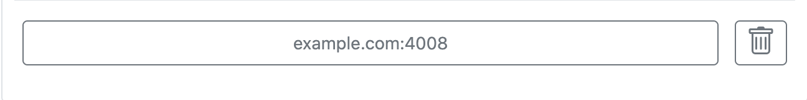

# Web interface

Alta settings are accessible through this control panel

## Login

Web interface available at [alta.cesbo.com](/en/book/transport/mpegts/){target="_blank"}. After clicking on the link, you will have access to the authorization panel

For authorization you need to enter your server address, login and password

If you have previously been authorized, then you will see a button to go to an already connected server. Each vatization of a new server adds it to the list of connected servers.

??? question "Authorization errors"

    Error: Server unreachable - Invalid server address

    Error: Invalid Credentials - Invalid login or password