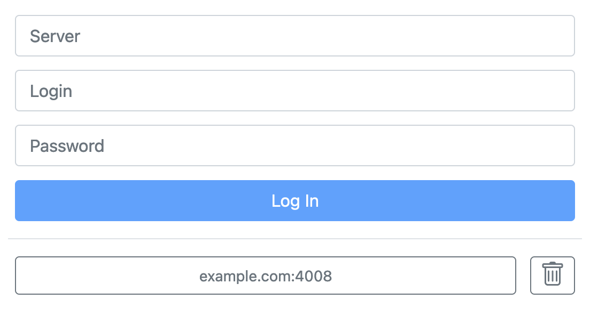

# Web interface

Web Interface allows to access and manage Alta directly with your web browser

## Login

Access the Alta web interface at [https://alta.cesbo.com](https://alta.cesbo.com){target="_blank"}. After clicking on the link, you will be taken to the login page where you can enter your credentials to gain access to the service.

{width="552"}

For authorization you need to enter:

- Your server address with port. For example: `https://example.com:4008`
- Login and Password for administrator

If you have previously been authorized, then you will see a button to go to an already connected server. Each authorization of a new server adds it to the list of connected servers.

## Connection

After loading web interface communicates directly with the Alta without third-party servers. Information about authorized servers stored in the browser's Local Storage.

## Troubleshooting

??? question "Server unreachable"

    - Invalid server address
    - Your computer is not connected to the VPN or private company network through which the server is accessed
    - Server communication port closed by firewall
    - Service not running on server
    - The server is down or not connected to the network

??? question "Invalid Credentials"

    - Invalid login or password. You may [reset your password](/en/alta/quick-start/reset-password/)
