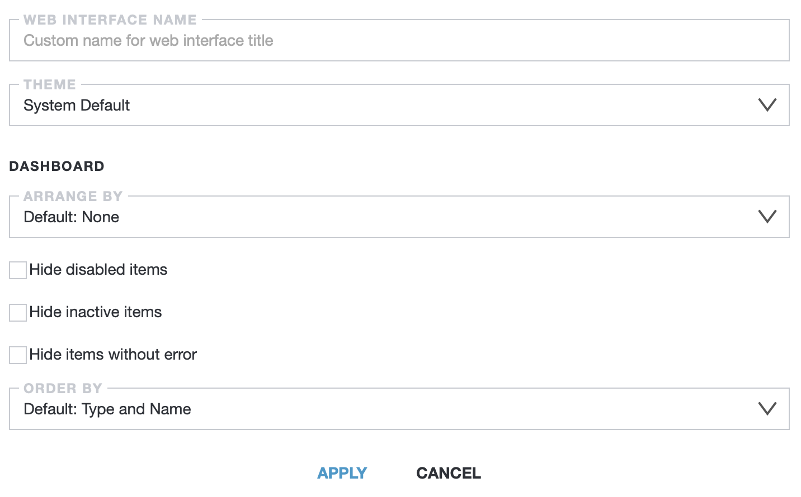

# View

This tab allows you to customize the visual style of the Astra interface and change the information display on the Dashboard tab.

- **Web interface name** - this field allows to enter an arbitrary name for the title of the web interface
- **Theme** - this drop-down list allows you to select a theme for the visual design of the Astra interface
  - **System Default** - automatically detected dark or light theme of the Astra interface. The theme is selected according to the theme of the web browser
  - **Light**
  - **Dark**
  - **Minimal** - minimalist dark theme variant. Simplifies the Astra interface, allowing it to take up less screen space

## Dashboard view

- **Arrange by** - this drop-down list allows to sorting servers and channels in the Dashboard tab according to certain parameters
  - **Default: None**
  - **Type**
  - **Servers**
  - **Adapter**
- **Hide disabled items** - the checkbox that hides streams and channels that have lost their functionality due to errors
- **Hide inactive items** - the checkbox that hides shuted down streams and channels
- **Hide items without error** - checkbox that hides running streams and channels with no errors
- **Order by** - this drop-down list allows to adjust the order of servers and channels in the Dashboard tab according to certain parameters
  - **Default: Type and Name**
  - **Type, Status and Name**
  - **LCN**