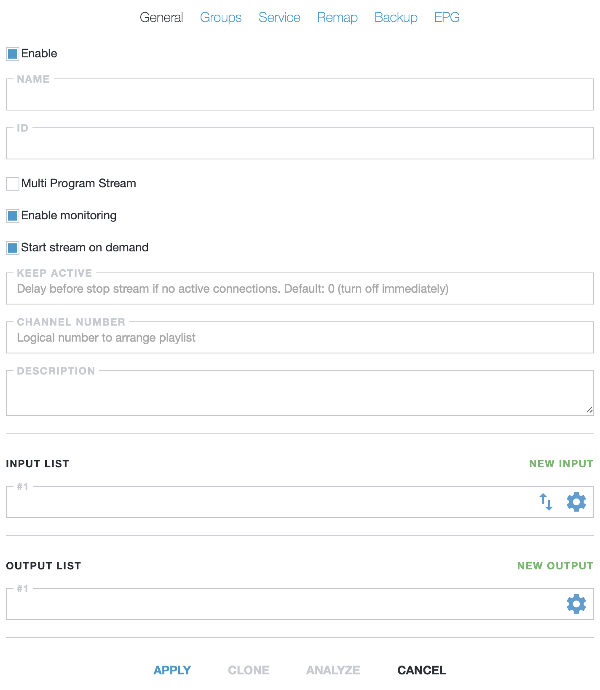
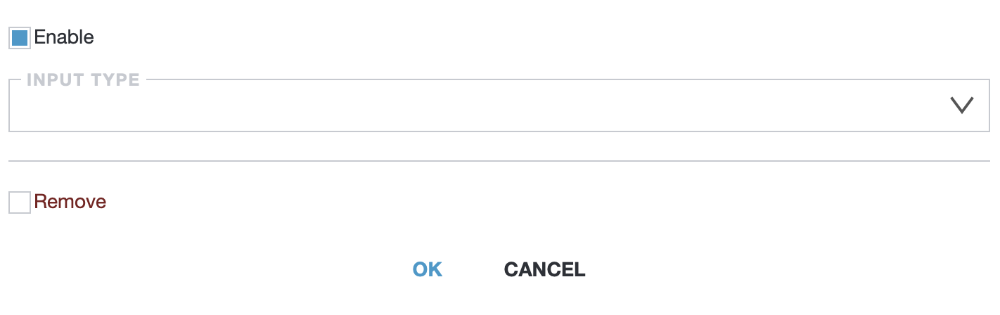
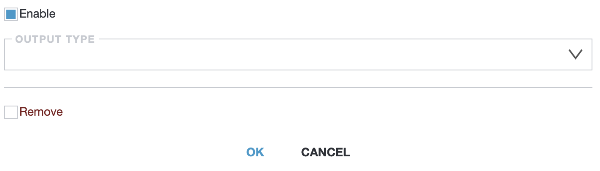
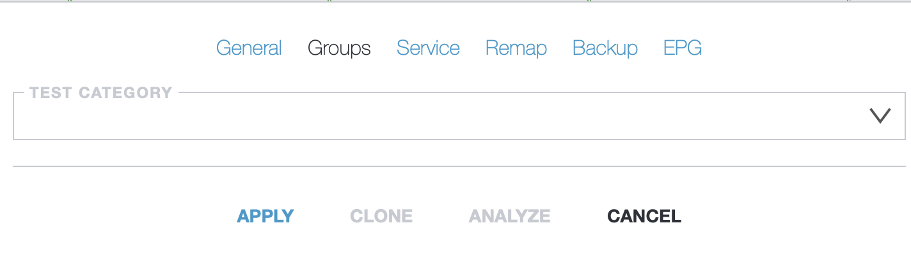
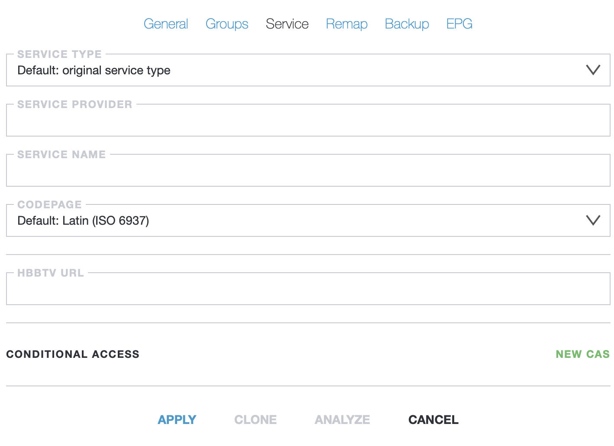
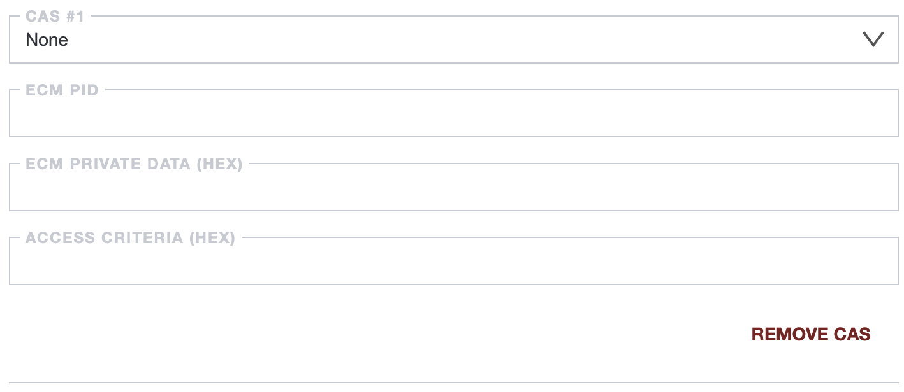
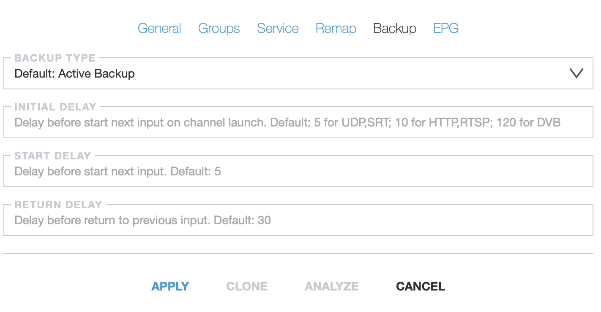
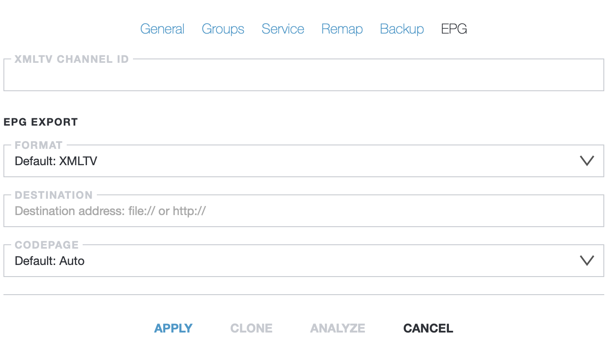

# Streams

This tab allows you to add a broadcast stream and configure its parameters

!!! note ""
    Stream could be two types:
    - SPTS - Single-Program Transport Stream. Streaming channels to the end users over IP network
    - MPTS - Multi-Program Transport Stream. Preparing multiplexes to DVB modulators

## General

The main tab bar that allows you to enter the main server parameters

- **Name** - this field allows to enter an arbitrary name for the stream
- **ID** - this parameter contains a unique identifier (ID). ID is generated when a new stream is created
- **Multi Program Stream** - MPTS stream. [Read more](/en/astra/output/broadcast/mpts/)
- **Enable monitoring** - checkbox allows you to use third-party monitoring tools. [Read more](/en/astra/index.md)
- **Start stream on demand** - this checkbox allows to disable the transmission of inputs with an HTTP connection if no user connects to the stream
- **Keep Active** - this parameter allows you to set a delay before turning off the stream with the "Start stream on demand" used. The default setting for this parameter is 0
- **Cahannel Number** - this parameter allows you to determine the serial number of the channel in the HTTP Play playlist
- **Input List** - the list of inputs for receiving the media stream. [Read more](/en/astra/input/)
- **New Input** - this button allows to add a new input. New inputs are used to continue sending traffic to users if another input goes down
- **Arrow icon** - this button allos to change the order of media streams
-  **Gear icon** - this button opens the media address setting window

!!! note ""
    Media address setting window:

    
    
    - **Enable** - this checkbox allows you to enable and disable the input. This feature is enabled by default
    - **Input type** - the drop-down list that allows you to select the type of input
      - **STR**
      - **DVB**
      - **HTTP/HLS**
      - **HTTPS/HLS**
      - **UDP**
      - **RTP**
      - **RTSP**
      - **MPEG-TS Files**
    - **Remove** - this checkbox allows you to remove the input. To confirm the action, you must click the "OK" button after checking the box

-  **Output List** - the list of outputs for sending the media stream. [Read more](/en/astra/output/)
- **New Output** - this button allows you to add a new output
- **Gear icon** - this button opens the media address setting window

!!! note ""
    Media address setting window:

    
    
    - **Enable** - this checkbox allows you to enable and disable the output. This feature is enabled by default
    - **Input type** - the drop-down list that allows you to select the type of output
      - **STR**
      - **HTTP/HLS**
      - **UDP**
      - **RTP**
      - **RESI Modulator**
      - **NetworkPush**
      - **MPEG-TS Files**
    - **Remove** - this checkbox allows you to remove the output. To confirm the action, you must click the "OK" button after checking the box

## Groups

This tab bar allows you to select an existing category to which the stream will belong

- **Test category** - the drop-down list that allows to select the category

!!! note ""
    If you need to learn more about the work of groups and categories in the aster interface, please read more. [Read more](/en/astra/settings/grops.md)

## Service

This tab allows you to configure the data about the company providing the channel and the parameters of channel that be transmitted

- **Service type** - this drop-down list allows you to select the type of channel that be transmitted
  - **Default: original service type**
  - **0x01 Digital teleevision service**
  - **0x02 Digital radio sound service**
  - **0x03 Teletext service**
  - **0x0A Advanced codec digital radio sound service**
  - **0x0C Data broadcast service**
  - **0x10 DVB MHP service**
  - **0x11 MPEG-2 HD digital television service**
  - **0x16 Advanced codec SD digital television service**
  - **0x19 Advanced codec HD digital television service**
- **Service provider** - this field used for entering the name of the company that transmits the channel
- **Service name** - this field used for entering the name of the transmitted channel
- **Codepage** - this drop-down list is used to specify the encoding of the transmitted channel
  - **Default: Latin (ISO 6937)**
  - **West European (ISO 8859-1)**
  - **East European (ISO 8859-2)**
  - **South European (ISO 8859-3)**
  - **North European (ISO 8859-4)**
  - **Cyrillic (ISO 8859-5)**
  - **Arabic (ISO 8859-6)**
  - **Greek (ISO 8859-7)**
  - **Hebrew (ISO 8859-8)**
  - **Turkish (ISO 8859-9)**
  - **Nordic (ISO 8859-10)**
  - **Thai (ISO 8859-11)**
  - **Baltic (ISO 8859-13)**
  - **West European (ISO 8859-15)**
  - **UTF-8**
- **HBBTV URL** - this field is used to enter the HTTP address of the HbbTV portal (Hybrid broadcast broadband TV)
- **Conditional access** - this panel is used to add [CAS encryption options](/en/astra/settings/cas.md)
- **New CAS** - button to add and configure a CAS for the "Conditional access" panel

!!! note ""
    

    - **CAS** - the drop-down list that contains previously added CAS
    - **ECM PID** - the parameter contains the PID for EMM packages in system
    - **ECM privat data (HEX)** - the parameter contains the data to add to the CAS table
    - **Access criteria (HEX)** - this parameter contains the CAS access code
    - **Remove CAS** - this button allows you to remove CAS from those added to the created channel. This option will not remove this CAS from the general list of created CAS

## Remap

This tab is used to configure the transmitted PID packets

!!! note ""
    The options presented only work for satellite broadcast, cable broadcast or digital television. These parameters do not affect broadcasting in IP networks (OTT, UDP)

- **Map PID's** - the field that allows to change the identifier for certain types of data packets

!!! note ""
    PID value can be from 1 to 8190, it is recommended to use values from 100 to 8000

    PID must not be repeated for channels with the same TSID

    **Example of filling in the "Map PID's" field:**
    `pmt=100, video=101, audio=102`
    - **pmt** - obligatory service table, which will contain identifier parameters for video and audio
    - **video and audio** - parameters and identifiers set for them

- **Filter PID's** - the field for compiling a list of PID packets to be left, which will be filtered from all others
- **Change PNR** - the parameter thar allows you to set the channel number used inside the Astra interface for its communication with other program components. This parameter can be from 1 to 65535 and cannot be repeated with other channels regardless of their TSID
- **Change TSID** - the parameter that allows you to set the transport stream ID
  
!!! note ""
    For their transmission, channels are combined into multiplexes (MPTS)

    TSID of MPTS cannot be repeated

    All channels in MPTS must have the same TSID

## Backup

This tab allows you to add sources for channel reservation

- **Backup type** - the drop-down list that allows to select the type of backup
  - **Default: Active Backup** - this option allows Astra to monitor the status of non-working sources while using backup sources. As soon as the performance of one of the backup sources of a higher order, or the main source is restored, the Astra interface will switch the broadcast to it
  - **Active Backup and Stop streaming** - this option is similar to the previous one, but it interrupts the broadcast as soon as the reserve for switching is exhausted
  - **Passive Backup** - this option allows Astra to turn off the previous broadcast source as soon as another one is used
  - **Disable** - this option prevents Astra from switching streaming between sources. Used to programmatically select the active source
- **Inital delay** - this parameter that determines the delay before switching to the next source of the broadcast stream
- **Start delay** - this parameter defines the delay before a new source of the broadcast stream is switched on
- **Return Delay** - this parameter defines the delay before returning to the previous source of the broadcast stream

## EPG

This tab allows you to configure how the program guide is saved to an XML file

- **XMLTV Channel ID** - the parametr that allows you to define the thread ID in the XML file. By default, it uses the TV channel ID from the "General" tab
- **EPG export** - this group of parameters allows you to import preset EPG settings
- **Format** - the drop-down list that allows you to choose the format of the exported data
  - **XMLTV**
  - **JSON**
- **Destination** - this field allows to specify the path to the imported file
- **Codepage** - drop-down list that allows you to select the channel encoding when it exporting
  - **Default: Auto**
  - **West European (ISO 8859-1)**
  - **East European (ISO 8859-2)**
  - **South European (ISO 8859-3)**
  - **North European (ISO 8859-4)**
  - **Cyrillic (ISO 8859-5)**
  - **Arabic (ISO 8859-6)**
  - **Greek (ISO 8859-7)**
  - **Hebrew (ISO 8859-8)**
  - **Turkish (ISO 8859-9)**
  - **Nordic (ISO 8859-10)**
  - **Thai (ISO 8859-11)**
  - **Baltic (ISO 8859-13)**
  - **West European (ISO 8859-15)**
  - **UTF-8**