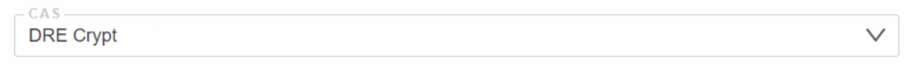
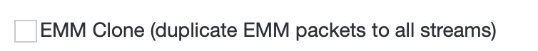

# CAS

Conditional Access System - a system for encrypting channels, protecting them from unauthorized access. The Astra interface allows you to set up a connection to conditional access systems using the [DVB Simulcrypt protocol](https://dvb.org/?standard=implementation-guidelines-of-the-dvb-simulcrypt-standard){target="_blank"}

- **CAS** - the drop-down list allows you to select a CAS profile, or create a new one by selecting the New CAS item

!!! note ""
    You may create a new one by selecting the New CAS item

- **NAME** - the parameter contains an arbitrary name of the CAS profile
- **CUPER CASS ID (HEX)** - the parameter contains CAS Identifier identifier that will be used by the CAS system. This value consists of 8 hexadecimal characters
- **Start Stream ID with 1** - this checkbox sets stream numbering from 1. This parameter is used if the specifics of your CAS system imply stream numbering starting from 1. As a default it starts at 0
- **ECMG Channel ID** - the parameter contains the channel identifier for connecting to CAS systems
- **ECMG Address** - the parameter contains the IP address of the ECMG server to which the encryption keys will be sent
- **ECMG Port** - the parameter contains the port of the ECMG server to which the encryption keys will be sent
- **Crypto period** - parameter defines the interval for changing the channel encryption key. The parameter value is described in seconds. The standard value of the parameter is 10
- **EMMG Protocol** - the drop-down list defines the protocol of interaction with the EMMG server
- **EMMG Port** - the parameter contains the port through which the connection to the EMG server takes place. This port is on the side of the server where the Astra interface is located
- **EMM PID** - the parameter contains the PID for EMM packages in system
- **EMM Private Data (HEX)** - the parameter contains the data to add to the CAS table

!!! note ""
    EMM Private Data is issued by the CAS provider. If you do not have data, then this parameter is not filled

- **EMM Clone** - this checkbox activates the function of adding EMM to each encrypted CAS channel. EMM package will be available on any channel at the end user