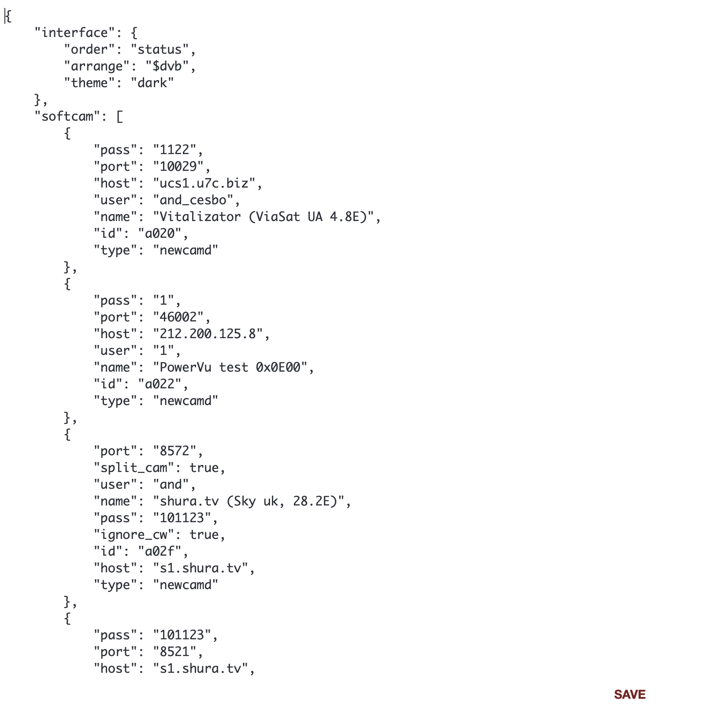

# Edit Config

This tab contains the parameters of the Astra interface, allowing you to access the configuration of the program at the code level

!!! danger ""
    Making any changes to these parameters is risky. We recommend using the functionality of this tab only in cases where you are completely sure of what you are doing