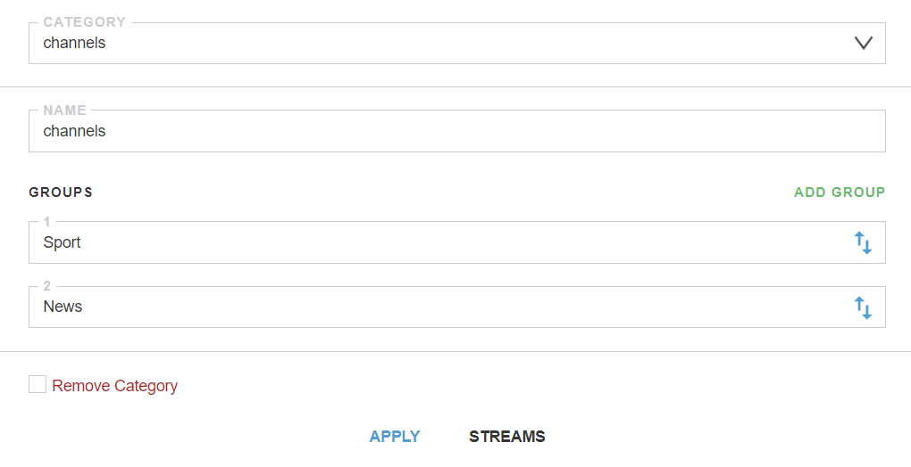
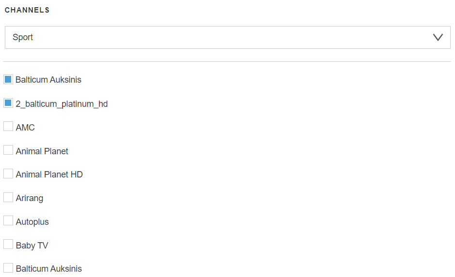

# Groups

The tab allows you to combine channels into separate groups according to various parameters and manage and configure them.

Groups/categories are used to sort channels in [http play](/astra/settings/http-play) to create packages of channels available to the user.


- **Category** - the drop-down list allows you to select a category to edit or create a new category. To create a new - name the category and click the button "ADD GROUP" to add streams groups
- **Name** - the parameter allows you to change the name of the category



- **Groups** - the Groups panel allows you to add groups to it and manage their order
- **Remove Category** - the Delete Category check box allows to completely delete this category. After checking the box, you need to click on the APPLY button

## Streams

When you click the Threads button, a new window will open. It presents a channel that can be combined into groups.



- **Channels** - the drop-down list allows to select the desired group of channels
- **Сheckboxes** - the list shows all available channels. Checking the box next to a channel adds it to the group

!!! note ""
    Categories/groups have a hierarchy:
    ```
    [category 1]
     - [group 1]
     - [stream/channel 1]
     - [stream/channel 2]
    - [group 2]
     - [stream/channel 3]
     - [stream/channel 4]
    [category 2]
    - [group 1]
     - [stream/channel 5]
     - [stream/channel 6]
    - [group 2]
     - [stream/channel 7]
     - [stream/channel 8]
    ```

!!! danger ""
    A stream cannot consist of multiple groups and categories at the same time
