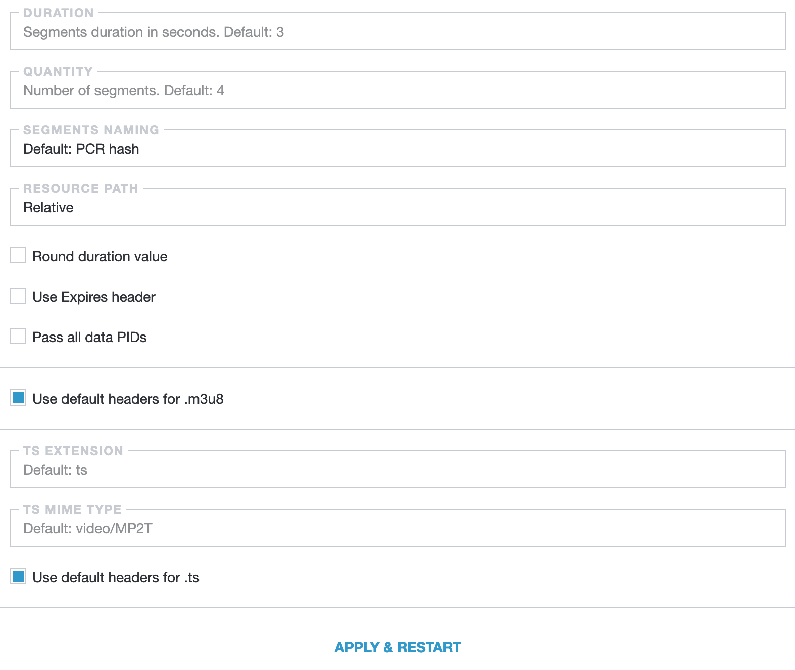

## HLS settings

Settings are in Settings -> HLS

- **Duration** - Segments duration in seconds. Default: 3
- **Quantity** - Number of segments. Default: 4
- **Segment Naming** - Segment name:
  - **PCR-hash** - PCR-hash (Default)
  - **Sequence** - sequential name
- **Resource path**
  - **Absolute** - default value, full URL with server address. For example: https://example.com/play/channel-id/segment-001.ts
  - **Relative** - a relative path is just a file name. For example: `segment-001.ts`
  - **Full** - full path, all directories and file name. For example: `/play/channel-id/segment-001.ts`
- **Pass all data PIDs** - by default, it only passes video and audio packets, if you enable the option, it will pass all the data that is in the stream (subtitles, epg)
- **Use Expires header** - Expires header contains the date/time, after which the response from the server is considered obsolete.
- **Use default headers for .m3u8** - ability to change http headers for `.m3u8`
  - **TS Extension** - extension for segments. As a default is `ts`
  - **TS mime type** - mime type for segments. As a default is `video/MP2T`
- **Use default headers for .ts** - ability to change http headers for `.ts`
