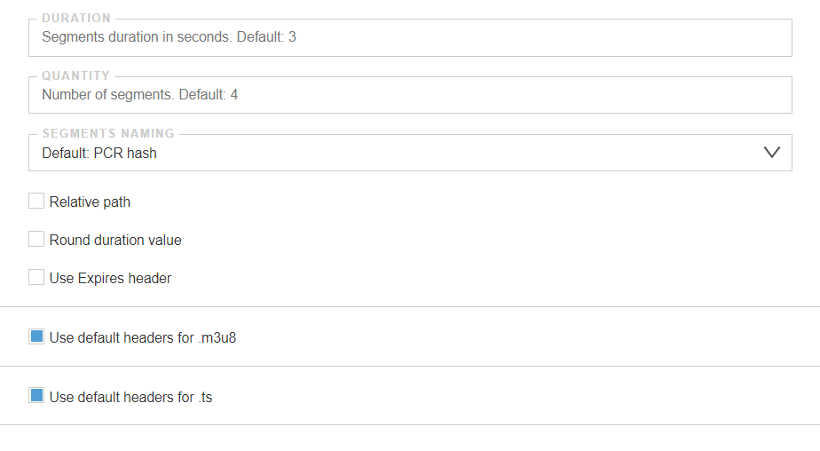

## HLS settings

Settings are in Settings -> HLS

- DURATION - Segments duration in seconds. Default: 3
- QUANTITY - Number of segments. Default: 4
- SEGMENT NAMING - Segment name:
  - PCR-hash - PCR-hash (Default)
  - sequence - sequential name

**Relative path**

**Round duration value** - by default, the duration of segments in m3u8 is described up to hundredths of a second. The option rounds to integers

**Use Expires header** - Expires header contains the date/time, after which the response from the server is considered obsolete.

**Use default headers for .m3u8** - ability to change http headers for `.m3u8`

**Use default headers for .ts** - ability to change http headers for `.ts`