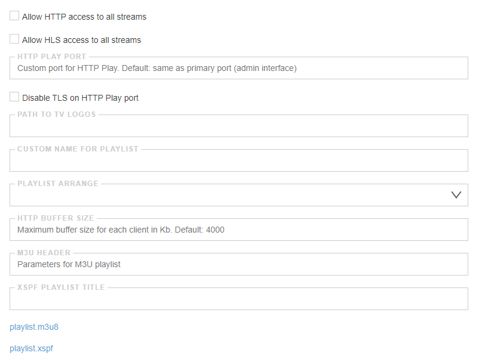

## HTTP Play

The tab is responsible for setting up the formation of a media stream playlist and connecting access to channels.

By the default HTTP Play disabled. To activate it open Settings -> HTTP Play.



- **Allow HTTP access to all streams** - this option allows to enable access to the channels with HTTP protocol
- **Allow HLS access to all streams** - this option allows to enable access to the channels with HLS protocol
  
!!! danger ""
    This option turn off activation on demand, all channels will works permanently. Also HLS Protocol use a lot of RAM, about 4Mb per 1Mbit 

- **HTTP play port** - parameter allows you to assign a port that will be used to transfer the playlist and media streams. It is used to separate the web interface and the playlist
- **Disable TLS on HTTP Play port** - this setting disables the use of HTTPS for this media playlist
- **Path to tv logos** - the parameter is used to specify the path to the logo file to stream logos in the playlist. 
- **Custom name for playlist** - the parameter renames playlist.m3u8 to an arbitrary name
- **Playlist arrange** - his option allows to select a category for grouping channels. You may configure groups in the Settings -> Groups
- **playlist.m3u8** - the parameter contains a link to the channel list. You may use playlist on the mobile devices, computer, TV, or Set-top-Box. To the link address you may append authentication details. Read more: [Access authorization](en/latest/astra/interface/index.md)

!!! danger ""
    By the default access authentication disabled. Without authentication unauthorized persons could get access to your channels with network scanners. To restrict access to your channels, please use [Access authorization](en/latest/astra/web-interface/settings/http-auth/) or System Firewall to limit access to your server

## Channel Logo

To install the logo, you need to specify the path to the logo file. The name of the stream must match the name of the icon. For example:

```
mkdir /var/lib/astra
cd /var/lib/astra
curl -LO https://epg.it999.ru/it999_transparent_logo.zip
unzip it999_transparent_logo.zip
mv it999_transparent_220x132 tvg-logo
rm it999_transparent_logo.zip
```

The path in the settings will be `/var/lib/astra/tvg-logo`

When the channel starts, the icon is cached in memory

The path to the icon in the playlist: http://server:8000/playlist/tvg-logo/id-stream.png