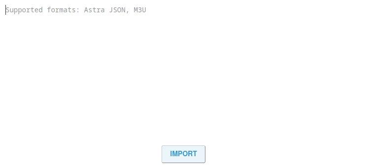

# Import

This tab is used to import Astra settings and configuration files

- **IMPORT** - In order to import the parameters, you need to copy them, paste them into the import window and start on the button
  
!!! note ""
    This feature also allows you to import an m3u file