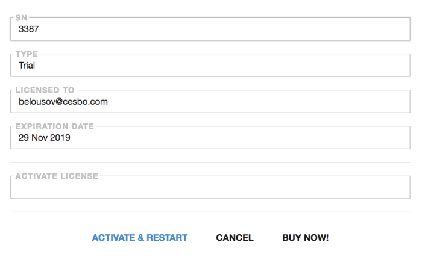

# License

The tab allows you to enter the current configuration and Astra license data.

- **SN** - field that contains the first 4 digits of the serial number
- **TYPE** - field that describing type of license being added or edited
  - **Demo**
  - **Subscription**
  - **Lifetime** - this paragraph implies that you can use any version of the Astra interface released up to date
- **LICENSET TO** - field that contains the e-mail to which the license was purchased
- **EXPIRATION DATE** - field that contains expiration date of the license. For Lifetime licenses field shows the date of license purchase
- **ACTIVATE LICENSE** - field that contains the contents of the file `license.txt`, that allows you to authorize and activate a specific version of Astra

!!! note ""
    After purchasing a license, a message with the license.txt file will be sent to your email address. After that, you will need to open this file and enter its contents in the ACTIVATE LICENSE field

- **ACTIVATE & RESTART** - This button launches the procedure for activating a license, or updating its status and parameters

!!! note ""
    You can also read a more detailed description of purchasing or upgrading a new license on the [corresponding page](/en/astra/quick-start/license.md)