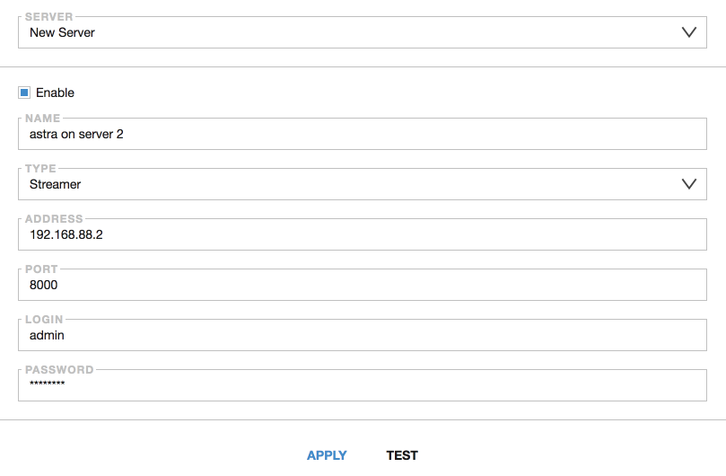

# Servers

The Servers tab allows you to combine data from several Asters interfaces located on other servers or ports in one window.

- **Server** - an item that allows you to select one of the already entered servers from the list, or add a new one
- **Enable** - checkbox for connecting and disconnecting the brought interface
- **Name** - arbitrary server name used solely for identification and navigation
- **Type** - the type of server to display the function it performs
- **Address** - ip addresss or dns name of the remote server. Computer from which the server interface is being monitored must have access to thisremote server
- **Port** - port of the remote server on which the Astra interface is running
- **Login** - the access login for the server you are adding
- **Password** - the access password for the server you are adding
- **Apply** - apply the specified settings and add the server to the list
- **Test** - allows you to check the connection to the added server. It is recommended to pre-use check before adding a server

After a new server is added, its streams and adapters will be added and displayed in the Dashboard tab.
When adding a new stream or adapter, you will be prompted to choose which server to create it on.
Cas and edit config options are also available from the remote server.