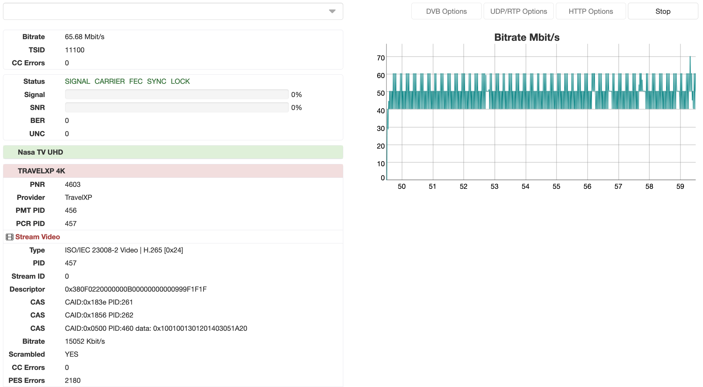

# MPEG-TS Analyzer

Astra has builtin stream analyzer.



## Usage

```
astra --analyze [OPTIONS] ADDRESS
```

Options:

- `-n seconds` - stop analyzer after defined time
- `-o file` - save stream received stream to the file
- `-p port` - launch analyzer with web interface. In this case Address option is not needed

## Address format

Analyzer supports any receiving format supported by Astra. For example:

```
udp://239.255.1.1:1234
http://example.com/media.m3u8
dvb://#adapter=0&type=s2&tp=11044:v:43200
```

More information described in the [Astra: Input](../input/index.md)

## Console

When astra launced with address in command line argument it print information directly to the console. For example:

```
> astra --analyze "udp://239.255.1.1:1234"

Nov 28 00:59:28: INFO: [main] Starting Astra (commit:b871b4e3 date:2022-01-12)
Nov 28 00:59:29: INFO: PAT tsid:1 version:1
Nov 28 00:59:29: INFO: PAT    PMT pid:115 pnr:1
Nov 28 00:59:29: INFO: PAT crc32:0x02575D2D
Nov 28 00:59:29: INFO: PMT pnr:1 version:1
Nov 28 00:59:29: INFO: PCR pid:215
Nov 28 00:59:29: INFO: VIDEO pid:215 type:0x1B
Nov 28 00:59:29: INFO: AUDIO pid:315 type:0x04
Nov 28 00:59:29: INFO: AUDIO    lang:eng
Nov 28 00:59:29: INFO: PMT crc32:0x9E87CF44
Nov 28 00:59:29: INFO: SDT tsid:1 version:3
Nov 28 00:59:29: INFO: SDT pnr:1
Nov 28 00:59:29: INFO: SDT    provider:Demo TV
Nov 28 00:59:29: INFO: SDT    service:Demo1
Nov 28 00:59:29: INFO: SDT crc32:0x9F98BF46
Nov 28 00:59:30: INFO: EIT tsid:1 onid:1 pnr:1 version:17
Nov 28 00:59:30: INFO: EIT    start:Wed Nov 28 00:10:00 2018
Nov 28 00:59:30: INFO: EIT    stop:Wed Nov 28 01:05:00 2018
Nov 28 00:59:30: INFO: EIT    lang:eng title:DOCUMENTARY
Nov 28 00:59:30: INFO: EIT crc32:0xC0BCCA18
Nov 28 00:59:30: INFO: Bitrate: 2323 Kbit/s
Nov 28 00:59:30: INFO: EIT tsid:1 onid:1 pnr:1 version:17
Nov 28 00:59:30: INFO: EIT    start:Wed Nov 28 01:05:00 2018
Nov 28 00:59:30: INFO: EIT    stop:Wed Nov 28 03:05:00 2018
Nov 28 00:59:30: INFO: EIT    lang:eng title:AUDIENCE (16+)
Nov 28 00:59:30: INFO: EIT crc32:0xE9257DFA
Nov 28 00:59:31: INFO: Bitrate: 2397 Kbit/s
Nov 28 00:59:32: INFO: Bitrate: 2755 Kbit/s
Nov 28 00:59:33: INFO: Bitrate: 4446 Kbit/s
```
